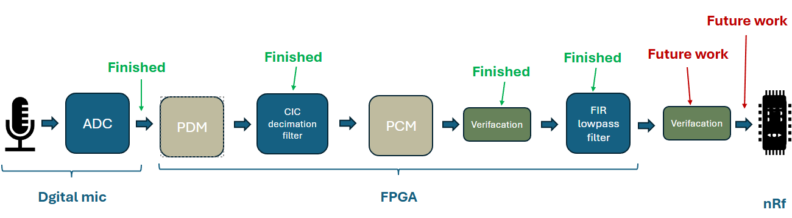
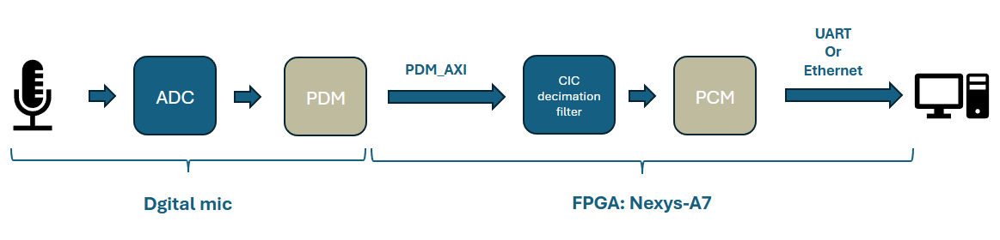
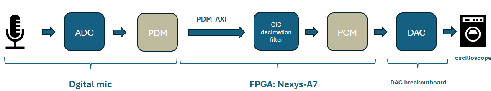
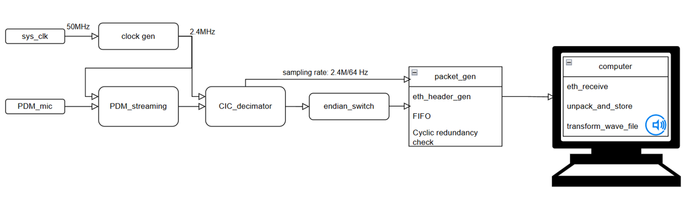
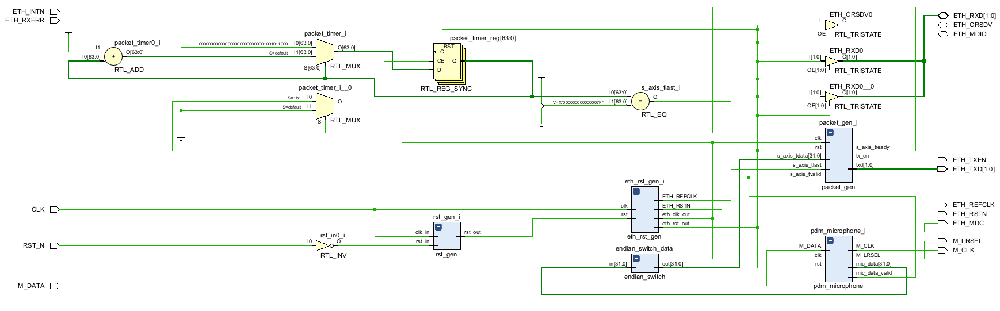
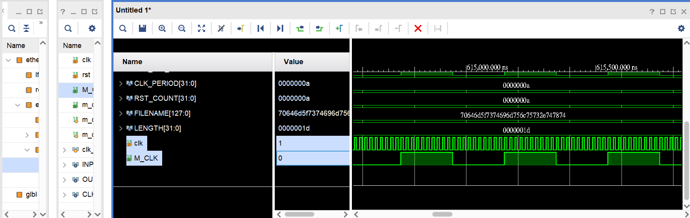
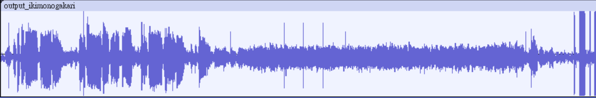
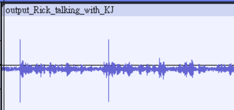

# 2024Fall_capstone

The project's goal is to implement the digital mic in the FPGA, do the signal processing with the mic_data ,send the result to the PC through Ethernet, and save the wavefile for the further Machine Learning usage.

## How to implement
Most of the code is from [this video](https://www.youtube.com/watch?v=m8O8yEiZTvs&t=437s&ab_channel=FPGAsforBeginners) and [Github](https://github.com/HDLForBeginners/Examples/tree/main/eth_pdm_mic). To run the original author's project easily, you can open the tcl file in the vivado and it will configure all the thing automatically.

To run the file, extract the rar file and run the .xpr file in the Vivado. All the blocks showed be configured automatically. However, if the Vivado update to a new version, some IP blocks migh be invalid. To fix the problem, click the IP INTEGRATOR, chose the same IP, and follow the original IP setting to configure a new one.

Note: You should choose the receive_finalized.py file to capture the Ethernet package if you are using Window OS.

## Hardware setting
FPGA: Nexys-A7 
Vivado: 2023.1 
PC: Window11

## Some results

### Overall flow chart
Last semester, I did the CIC decimator & FIR lowpass filter blocks & the breakout board of the digital mic. This semester, I did the integration of the digital mic and the CIC decimatior. I implemented them into the FPGA to actually run the hardware and verify the functionality through the PC output.

*Figure 2: overall flow chart*

*Figure 3: Verification flow chart - PC*

If you want to do a normal verification flow with ocilloscope, you will need a DAC breakout board to transfer the PCM signal to I2S and play it on the ocilloscope.

  

<em>Figure 1: Verification flow chart - Oscilloscope</em>

#### Verification Dataflow

*Figure 4: Verification Dataflow-Ethernet*

*Figure 1: Dataflow_schematic*

### Slow down the clk
Since the digital mic's working frequency is lower than 3MHz, and the min clock frequency from FPGA is 5MHz, we need to slow the clk down to meet the target frequency.

*Figure 1: self_sampling_clk*

*Figure 1: Waveform result: Japanese song*

*Figure 1: Waveform result: Wekly meeting*
